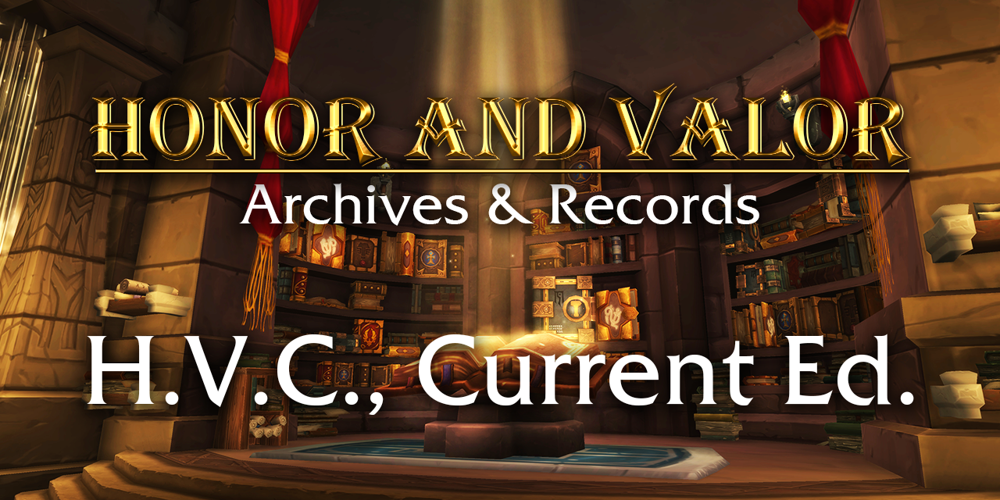

- [Front Matter](#front-matter)
  - [Organic Laws](#organic-laws)
    - [The Litany of Honor and Valor](#the-litany-of-honor-and-valor)
      - [Article I](#article-i)
      - [Article II](#article-ii)
      - [Article III](#article-iii)
      - [Amendment I](#amendment-i)
        - [Section 1](#section-1)
        - [Section 2](#section-2)
- [Title 1—General Provisions](#title-1general-provisions)
  - [TITLE 1—Front Matter](#title-1front-matter)
  - [CHAPTER 1—RULES OF CONSTRUCTION](#chapter-1rules-of-construction)
    - [§1. Words denoting number, gender, and so forth](#1-words-denoting-number-gender-and-so-forth)
  - [CHAPTER 2—CODE OF LAWS OF HONOR AND VALOR AND SUPPLEMENTS](#chapter-2code-of-laws-of-honor-and-valor-and-supplements)
    - [§101. Preparation and publication of Codes and Supplements](#101-preparation-and-publication-of-codes-and-supplements)
    - [§102. Codes and Supplements as evidence of the laws of Honor and Valor; citation of Codes and Supplements](#102-codes-and-supplements-as-evidence-of-the-laws-of-honor-and-valor-citation-of-codes-and-supplements)
    - [§103. Codes and Supplement; where printed; form and style; ancillaries](#103-codes-and-supplement-where-printed-form-and-style-ancillaries)
- [Title 2—The House](#title-2the-house)
  - [TITLE 2—Front Matter](#title-2front-matter)
  - [CHAPTER 1—THE LEGISLATIVE POWER](#chapter-1the-legislative-power)
    - [§1. Dissolution of the House](#1-dissolution-of-the-house)
- [Title 3—The Corps of Commanders](#title-3the-corps-of-commanders)
  - [TITLE 3—Front Matter](#title-3front-matter)
  - [CHAPTER 1—THE COMMANDER-IN-CHIEF](#chapter-1the-commander-in-chief)
    - [§1. Officer role](#1-officer-role)
    - [§2. Eligibility](#2-eligibility)
    - [§3. Removal](#3-removal)
    - [§4. Executive powers](#4-executive-powers)
    - [§5. Responsibilities](#5-responsibilities)
  - [CHAPTER 2—KEEPING THE PEACE](#chapter-2keeping-the-peace)
    - [§101. Officer role](#101-officer-role)
    - [§102. Eligibility](#102-eligibility)
    - [§103. Enforcement powers](#103-enforcement-powers)
    - [§104. Rule of law](#104-rule-of-law)
  - [CHAPTER 3—APPOINTMENT OF CITIZENS AS DEPUTIES](#chapter-3appointment-of-citizens-as-deputies)
    - [§201. Appointment of Citizens](#201-appointment-of-citizens)
    - [§202. Extraordinary Circumstances](#202-extraordinary-circumstances)
    - [§203. Official Notification of Deputization](#203-official-notification-of-deputization)
    - [§204. Waiver of Commander's Oath Requirement](#204-waiver-of-commanders-oath-requirement)
- [Title 4—Crime Control and Law Enforcement](#title-4crime-control-and-law-enforcement)
  - [TITLE 4—Front Matter](#title-4front-matter)
  - [CHAPTER 1—OFFENSES AGAINST PUBLIC ORDER AND SAFETY](#chapter-1offenses-against-public-order-and-safety)
    - [§1. Purpose](#1-purpose)
    - [§2. Communication based conflict](#2-communication-based-conflict)
    - [§3. Harassment](#3-harassment)
    - [§4. Nuisance behavior](#4-nuisance-behavior)
    - [§4a. Offensive expression](#4a-offensive-expression)
    - [§4b. Obstruction of play](#4b-obstruction-of-play)
    - [§4c. Fraud](#4c-fraud)
    - [§4d. Impersonation](#4d-impersonation)
    - [§5. Political, religious, commercial, and promotional activities](#5-political-religious-commercial-and-promotional-activities)
    - [§6. Breaking the chain that binds](#6-breaking-the-chain-that-binds)
    - [§7. Ignoring a Commander's instructions](#7-ignoring-a-commanders-instructions)
  - [CHAPTER 2—OFFENSES AGAINST HARDCORE PLAYERS](#chapter-2offenses-against-hardcore-players)
    - [§101. Murder; Malice Murder; Statutory Murder](#101-murder-malice-murder-statutory-murder)
    - [§102. Voluntary Character Slaughter](#102-voluntary-character-slaughter)
    - [§103. Involuntary Character Slaughter](#103-involuntary-character-slaughter)
    - [§104. Use of Force in Duels to the Death and Defense of the Alliance](#104-use-of-force-in-duels-to-the-death-and-defense-of-the-alliance)
    - [§105. Immunity from Criminal Liability of Players Committing Offenses as the Direct Result of a Hardware or Software Defect](#105-immunity-from-criminal-liability-of-players-committing-offenses-as-the-direct-result-of-a-hardware-or-software-defect)
  - [CHAPTER 3—OFFENSES IN FORMAL COMBAT](#chapter-3offenses-in-formal-combat)
    - [§201. Desertion](#201-desertion)
    - [§202. Away without Permission](#202-away-without-permission)
    - [§203. Misbehavior before Other Guilds](#203-misbehavior-before-other-guilds)
- [Title 5—Recruitment](#title-5recruitment)
  - [TITLE 5—Front Matter](#title-5front-matter)
- [Title 6—Citizenship](#title-6citizenship)
  - [TITLE 6—Front Matter](#title-6front-matter)
  - [CHAPTER 1—PATHS TO CITIZENSHIP](#chapter-1paths-to-citizenship)
    - [§1. Raiding](#1-raiding)
    - [§2. Remaining Mortal at Maximum Level in Hardcore](#2-remaining-mortal-at-maximum-level-in-hardcore)
  - [CHAPTER 3—LOSS OF CITIZENSHIP](#chapter-3loss-of-citizenship)
    - [§101. Renunciation of Citizenship](#101-renunciation-of-citizenship)
    - [§102. Loss of Citizenship](#102-loss-of-citizenship)
- [Title 7—Raiding](#title-7raiding)
  - [TITLE 7—Front Matter](#title-7front-matter)
  - [CHAPTER 1—LOOT SYSTEM](#chapter-1loot-system)
    - [§1. Process](#1-process)
  - [CHAPTER 2—PROGRESSION](#chapter-2progression)
    - [§101. Progression instances](#101-progression-instances)
    - [§102. Required consumables](#102-required-consumables)
    - [§103. Required add-ons](#103-required-add-ons)
  - [CHAPTER 3—RAID GROUPS](#chapter-3raid-groups)
    - [§201. Raid leaders](#201-raid-leaders)
    - [§202. Scheduling](#202-scheduling)
    - [§203. Loot governance](#203-loot-governance)
    - [§204. Disenchanting](#204-disenchanting)
    - [§205. Guild bank reserved items](#205-guild-bank-reserved-items)
- [Title 8—Banking](#title-8banking)
  - [TITLE 8—Front Matter](#title-8front-matter)
  - [CHAPTER 1—THE GUILD BANK](#chapter-1the-guild-bank)
    - [§1. Guild bank reserved items](#1-guild-bank-reserved-items)
  - [CHAPTER 2—ADMINISTRATION](#chapter-2administration)
    - [§101. Bankers](#101-bankers)
    - [§102. Guild bank configuration](#102-guild-bank-configuration)
    - [§103. Contributions](#103-contributions)
    - [$104. Capital conversion](#104-capital-conversion)
  - [CHAPTER 3—IN LIEU OF BLIZZARD FUNCTIONALITY](#chapter-3in-lieu-of-blizzard-functionality)
    - [§301. Delegate character storage](#301-delegate-character-storage)
- [Title 9—The Discord Server](#title-9the-discord-server)
  - [TITLE 9—Front Matter](#title-9front-matter)
- [Title 10—Judiciary and Judicial Procedure](#title-10judiciary-and-judicial-procedure)
  - [TITLE 10—Front Matter](#title-10front-matter)
  - [CHAPTER 1—THE JUDICIAL POWER](#chapter-1the-judicial-power)
    - [§1. Dissolution of the Judiciary](#1-dissolution-of-the-judiciary)

# Front Matter

## Organic Laws

### The Litany of Honor and Valor
In the beginning, there was naught but those who sought to walk in the Light—to set wrong things right—to stand tall and proud rather than cower from the fight.

They came from the south.
They came from the north.
But the gaps between them on a map became as nothing as they adventured forth.
 
For those gaps were bridged with a bond.
Acquaintances became friendships, until finally a family dawned.
That bond was not mightily forged in a day, it took years: grown steadily, nurtured with laughter and tears.
 
Some of them came and some of them went.
On desperate occasions their principles bent.
Moments of glory waxed and waned.
All too often they lost hope, along with all else they thought they had gained.
But amidst all the drama and odds that had left them drained, hope was never truly lost, for the family remained.
 
And lo, at long last, it was finally decided that the problem was not “in whom” but “how” the power resided.
It had always been known that for goals to be achieved that one and only one of them could be called upon to lead.
But now, as obligations or apathy pull one leader away, another of the family will answer the call and enter the fray.
 
This flaw in the past was not easily found, especially whenever hucksters sewing distrust did abound.
But now we understand that all in time will break down when saddled with the full weight of the crown.
 
To consecrate this litany and honor that we have all bled, the Marshal has rightfully begun his tenure when he has said: “Through our shared years and tears, I trust in my brothers as I take this throne that none of us again shall be asked to walk an unending path alone.”

#### Article I
This guild holds that all players possess rights which are corollaries of ethics as applied to social organizations.
These are: the right to one's own characters; the right to play as one wishes; the right to keep, use, and dispose of the gold and items one has created or looted; and the right to play for one's own sake and fulfillment.
 
These rights are not granted by the guild but are a part of and given rise from the players and are inalienable.
 
This guild holds further that it exists only as an institution charged with securing these rights, and that should a guild become destructive of that end, it is the right of the players to alter or to abolish it as they see fit in order to effectively secure their rights.
 
These rights are the only ones treated by this Litany.
They are the only rights formulated in terms of broad abstractions and resting directly on universal ethical principles.
The numerous applications and implementations of these rights, such as the right to attend guild functions or to be tried fairly for the violation of the rights of others, are charged to the Marshal and require for their validation a process of reduction to these abstract rights.

#### Article II
All members of the guild that understand and agree with its founding principles as outlined in Article I and whose membership shall have attained to the duration of ten years since invitation, regardless of lapses in membership, shall form the Veterans of Honor and Valor.
 
The Veterans shall select from among their ranks a single person to serve as Marshal of Honor and Valor.
If there are multiple Veterans willing to serve, the winner of a duel or series of duels will become the Marshal.
The Marshal is still a Veteran regardless of his current elevated position.
When the Marshal decides to step down, he may choose his replacement from among the Veterans.
If he does not make a selection, the Veterans must choose from among themselves using the above method.
 
When any two Veterans duel, each combatant may choose a champion from among any current and willing member of the guild to fight in a duel on their behalf.
The victor of a duel must have struck the final blow and there must have been no combat interference from other players during the duel.

Should a Veteran determine that the Marshal should be replaced, and the Marshal is unwilling to surrender his post, the Veteran may challenge the Marshal in person to a duel.
The Marshal may not refuse the challenge but may choose the setting of the duel.
If the Marshal fails to choose a setting within three days of the challenge being issued, the Veteran may choose the setting, and if the Marshal fails to attend then the duel is forfeit in favor of the Veteran.
If the Veteran is the victor, he shall become the new Marshal.
If the Veteran is not the victor, he shall not be able to challenge the Marshal again for ninety days.
 
Before a Veteran enters his office, he shall take the following oath: “I hereby declare, on oath, that I absolutely and entirely renounce and abjure all allegiance and fidelity to any guild of which I have heretofore been a subject or citizen; that I will support and defend the Litany of Honor and Valor against all enemies, from those outside the guild, to the very Marshal himself should the need arise under my own rational principles and reasonable conscience; that I will bear true faith and allegiance to the Litany of Honor and Valor; and that I take this obligation freely without any mental reservation.”

#### Article III
The legislative, executive, and judicial power of the guild shall be vested in the Marshal of Honor and Valor.
 
The Marshal must create uniform regulations for: recruitment and dismissal; looting in raids; punishment for breaking social etiquette or guild rules; organizing communication channels outside of the game; organizing raid groups and PvP teams; and, securing gold or materials for progression.
The Marshal may choose to delegate any of these responsibilities to Veterans or Commanders.
 
No regulations can be exercised against a member of the guild ex post facto.

The Marshal may appoint any individual within the guild to whom he delegates a portion of his authority to serve as a Commander for such purposes and until such time that the Marshal may decide.
Before a Commander enters his office, he shall take the following oath: “I, of my own free will, without coercion, promise, or inducement of any sort, after having been duly advised and warned of the meaning and consequences of this oath, do now enroll in the Raiding or PvP Service of the Guild of Honor and Valor. I swear to uphold and defend the Guild of Honor and Valor against all its enemies, to protect and defend the liberties and privileges of all its citizens and civilians, to perform such duties as may be assigned to me by direct or delegated authority, and to obey all orders of the Marshal of Honor and Valor and of all Commanders or delegated persons placed over me, and to require such obedience from all members of the Service or other persons placed under my orders - and, while remaining in active service or upon being granted inactive retired status, to carry out all duties and obligations and to enjoy the privileges of guild citizenship.”
 
The Marshal may delegate powers to groups of Veterans and Commanders to act collectively as legislative, executive, or judicial bodies.
The Marshal may grant to each body the privilege to determine the rules of its proceedings.
Acts of legislative bodies must gain the assent of the Marshal to take effect.

#### Amendment I
(Ratified on the thirtieth of April 2022)

##### Section 1
The requirement of attained duration of years since invitation for Veterans of Honor and Valor is hereby repealed.

##### Section 2
A Veteran may sponsor the invitation of a member of the guild to join the Veterans of Honor and Valor.
When this occurs, the matter shall be put to a vote of the Veterans of Honor and Valor for a period not exceeding three days.
If three fourths of those voting are in favor, the sponsored member shall become a Veteran upon taking the oath.

# Title 1—General Provisions

## TITLE 1—Front Matter
Title 1 of the Honor and Valor code entitled "General Provisions" is codified into positive law and may be cited as '1 H. V. C., §--.'

## CHAPTER 1—RULES OF CONSTRUCTION

### §1. Words denoting number, gender, and so forth
In determining the meaning of any part of the Code, unless the context indicates otherwise—
* words importing the singular include and apply to several persons, parties, or things;
* words importing the plural include the singular;
* words importing the masculine gender include the feminine as well;
* words used in the present tense include the future as well as the present;
* the words "insane" and "insane person" shall include every idiot, insane person, and person non compos mentis;
* the words "person" and "whoever" include friend groups, guilds, cliques, parties, raids, and teams, as well as individuals;
* "officer" includes any person authorized by law to perform the duties of the office;
* "signature" or "subscription" includes a mark when the person making the same intended it as such;
* "oath" includes affirmation, and "sworn" includes affirmed;
* "writing" includes printing and typewriting and reproductions of visual symbols by photographing, multigraphing, mimeographing, manifolding, or otherwise.

## CHAPTER 2—CODE OF LAWS OF HONOR AND VALOR AND SUPPLEMENTS

### §101. Preparation and publication of Codes and Supplements
There shall be prepared and published under the supervision of the Marshal or his designee—
1. A supplement for each session of the House to the then current edition of the Code of Laws of Honor and Valor, cumulatively embracing the legislation of the then current supplement, and correcting errors in such edition and supplement;
2. New editions of the Code of Laws of Honor and Valor, correcting errors and incorporating the then current supplement. In the case of each code new editions shall not be published oftener than once in each three months. Copies of each such edition shall be distributed in the same manner as provided in the case of supplements to the code of which it is a new edition. Supplements published after any new edition shall not contain the legislation of supplements published before such new edition.

### §102. Codes and Supplements as evidence of the laws of Honor and Valor; citation of Codes and Supplements
In all courts, tribunals, and public offices of Honor and Valor—
1. The matter set forth in the edition of the Code of Laws of Honor and Valor current at any time shall, together with the then current supplement, if any, establish prima facie the laws of Honor and Valor, general and permanent in their nature, in force on the day preceding the commencement of the session following the last session the legislation of which is included: Provided, however, That whenever titles of such Code shall have been enacted into positive law the text thereof shall be legal evidence of the laws therein contained.
2. Supplements to the Code of Laws of Honor and Valor may be cited as "H.V.C., Sup.  ", the blank in each case being filled with Roman figures denoting the number of the supplement.
3. New editions of each of such codes may be cited as "H.V.C.,  ed.", the blank in each case being filled with figures denoting the last year the legislation of which is included in whole or in part.

### §103. Codes and Supplement; where printed; form and style; ancillaries
The publications provided for in section 202 of this title shall be maintained by the Marshal or his designee and shall be in such form and style and with such ancillaries as may be prescribed by the House. The Marshal is directed to cooperate with the House in the preparation of such ancillaries. Such publications shall be furnished with such thumb insets and other devices to distinguish parts, with such facilities for the insertion of additional matter, and with such explanatory and advertising slips, as may be prescribed by the House.

# Title 2—The House

## TITLE 2—Front Matter
Title 2 of the Honor and Valor code entitled "The House" is codified into positive law and may be cited as '2 H. V. C., §--.'

## CHAPTER 1—THE LEGISLATIVE POWER

### §1. Dissolution of the House
The House is currently dissolved.
When this Code refers the House, the Marshal stands in its place, acting on its behalf.

# Title 3—The Corps of Commanders

## TITLE 3—Front Matter
Title 3 of the Honor and Valor code entitled "The Corps of Commanders" is codified into positive law and may be cited as '3 H. V. C., §--.'

## CHAPTER 1—THE COMMANDER-IN-CHIEF

### §1. Officer role
The Commander-in-chief is an officer role which, when occupied, has been delegated the executive power of the Marshal under Article III of the Litany of Honor and Valor.

### §2. Eligibility
No person except a member of this guild for at least one year, or a Veteran of Honor and Valor, shall be elligible to the office of Commander-in-chief; neither shall any person be eligible to that office who shall not have attained to the age of twenty-five years.

### §3. Removal
In case of the removal of the Commander-in-chief from office, or of his death, resignation, or inability to discharge the powers and duties of the said office, the same shall return to the Marshal of Honor and Valor.

### §4. Executive powers
The Commander-in-chief:
* shall be in command of the raiding teams and all other Officers of Honor and Valor;
* may require the opinion, in writing or in discussion, of any principal officer upon any subject relating to the duties of their respective offices;
* shall have power to grant reprieves and pardons for offenses against Honor and Valor, except in cases of impeachment;
* shall have power, by and with the advice and consent of the House, to make treaties, provided two-thirds of the Representatives of the House present concur;
* shall appoint, with the advice and consent of the House, all other Officers of Honor and Valor, whose appointments are not herein otherwise provided for, and which shall be established by law;
* may, on extraordinary occasions, convene the House; and,
* shall have power to fill up all vacancies that may happen during the recess of the House, by granting commissions that shall expire at the end of their next session.

### §5. Responsibilities
The Commander-in-chief shall faithfully execute his Office, and will to the best of his ability, preserve, protect, and defend the Litany of Honor and Valor.

He shall from time to time give to the House information of the State of the Guild, and recommend to their consideration such measures as he shall judge necessary and expedient.
He shall receive ambassadors and other public ministers from outside the guild, and shall commission all the Officers of Honor and Valor.

He shall guarantee to every member of this guild equal protection under the law, and when the House of Representin' cannot be convened, shall provide for the continuing maintenance and enhancement of the Code of Honor and Valor, although he may delegate the implementation of the same to what legislative clerical services are available.

## CHAPTER 2—KEEPING THE PEACE

### §101. Officer role
All Commanders of Honor and Valor may, and those without any other specific delegated authority shall, keep the peace in the guild.

### §102. Eligibility
No person except a member of this guild for at least one month shall be eligible to the general office of Commander; neither shall any person be eligible to that office who shall not have attained to the age of twenty years.

### §103. Enforcement powers
Except where otherwise provided by law, a Commander when keeping the peace is granted authority and power in limited scope as defined by Chapter 1 of Title 4 of this code.

### §104. Rule of law
No member of this guild, including but not limited to the Representatives of the House, Commanders, the Commander-in-chief, any judicial bodies or officers which may be provided for by the Marshal or this code, Veterans of Honor and Valor, and the Marshal are beyond the scope or reach of the law.
Commanders are required to apply the law to each member of the guild equally.

## CHAPTER 3—APPOINTMENT OF CITIZENS AS DEPUTIES

### §201. Appointment of Citizens
Veterans of Honor and Valor and the Commander-in-chief may, under extraordinary circumstances as specified by section 202 of this title, appoint a citizen as special deputy to keep the peace as specified by Chapter 2 of this title, provided such appointed citizen is not otherwise disqualified to serve as a Commander.
Failure of the deputy to correctly enforce the Litany of Honor and Valor or this code shall be the responsibility of the deputizer.

### §202. Extraordinary Circumstances
Whether extraordinary circumstances exist to warrant deputization as specified in section 201 may be determined either by the Marshal or the Council of Veterans in a simple majority of those voting for the purpose.
The extraordinary circumstances begin and end when the House is officially notified in a message delivered to the floor.

### §203. Official Notification of Deputization
When a citizen is deputized or relieved of duty, the deputizer is required to notify the House via a message delivered to the floor.

### §204. Waiver of Commander's Oath Requirement
Deputies are not required to take the oath specified in Article III of the Litany of Honor and Valor as even though they may be promoted to the Commander rank in-game or given the Commanders role in Discord, they are distinct from full Commanders.

# Title 4—Crime Control and Law Enforcement

## TITLE 4—Front Matter
Title 4 of the Honor and Valor code entitled "Crime Control and Law Enforcement" is codified into positive law and may be cited as '4 H. V. C., §--.'

## CHAPTER 1—OFFENSES AGAINST PUBLIC ORDER AND SAFETY

### §1. Purpose
In Honor and Valor, obstructive behavior that has an adverse impact on others' gameplay is prohibited.
Such behavior violates the terms of this statute.
If a violation is confirmed as a result of the Corps of Commanders investigations, they may, in their sole discretion, issue a penalty to the offending guild members as specified by the section defining the offense.

### §2. Communication based conflict
Honor and Valor is a guild where members come together and interact with one another.
Communication is vital in human-to-human interactions, but it goes without saying that individuals feel and interpret things differently and often comments or behavior that are not offensive to one person may make another feel offended or uncomfortable.
Extreme content which Commanders deem particularly disagreeable and undesirable in constructive exchanges between members of the guild is prohibited.

Communication can take place in a variety of styles.
As such, specific words or sentences are not prohibited in and of themselves.
Instead, Commanders look at the whole picture in order to judge the intent and meaning of the communication, in conjunction with how the person on the receiving end perceived it, to determine whether or not the exchange runs afoul of this section.

Please be kind and respectful and keep in mind how others may feel about what you say.
If you think your comment may make another person feel even a little uncomfortable, it would be best to refrain from saying it.

Additionally, something that may be intended as a "joke" between friends could in fact make the other person feel uncomfortable but they may not say so to be considerate.
This rings true even for longtime friends where respect may be more important in the relationship.

Please note, that even in situations where a violation is made, if the parties involved can reach a mutual resolution, Commanders will not then treat it as such.
Communication based conflicts can be resolved via subsequent communication.
Therefore, if you accidentally express something inappropriately, you are encouraged to accept your mistake and take the appropriate action to correct it.

Where the Corps of Commanders determines a member is in violation of this section, the member will be asked to resolve the issue.
If the member cannot or will not do so, a warning will be issued.
Once three warnings for violations of this section have been issued within a ninety-day period and it is violated again within that period, a penalty up to dismissal may be imposed.

### §3. Harassment
"Harassment" is speech and/or behavior that inflicts deep emotional distress on another person.
It is an extremely serious violation.

It is prohibited to do this anywhere an expression can be made, including in-game chat and voice chat.

A non-exhaustive list of behavior, when done with the intent of causing emotional distress, that could constitute harassment in Honor and Valor includes:
* discriminatory expressions based on race/nationality/thinking/gender/sexual orientation/gender identity/disability;
* discriminatory expressions about a state/religion/occupation/organization, etc.;
* expressions that promote, advocate, or direct anyone to commit any form of self-harm;
* obscene/indecent expressions;
* actions that inflict emotional distress by using expressions related to historical events or crimes;
* stalking;
* disclosing a person's information such as contact information with the aim of meeting up in the real world;
* disclosing another person's real-world personal information without permission; and,
* other actions that are generally regarded as inflicting deep emotional distress on another person.

Where the Corps of Commanders determines that harassment has occurred, a warning will be issued.
Once one warning for violation of this section has been issued and it is violated again, a penalty up to dismissal may be imposed.
If the harassment contains the aggravating component of a potential real-life physical threat (e.g. doxxing), the requirement to first issue a warning is waived and the violation may result in immediate dismissal.

### §4. Nuisance behavior
"Nuisance behavior" is speech or behavior that hurts others or obstructs their gameplay, but which is not classified as harassment.
Even if it was not intended, a penalty may be issued if the end result was that another person was hurt, or their gameplay was obstructed.

Where the Corps of Commanders determines a member is in violation of section 4 through section 4d, a warning will be issued.
Once three warnings for violations of these sections have been issued and they are violated again, a penalty up to dismissal may be imposed.

A non-exhaustive list of behavior, when done with or without the intent of causing emotional distress, that could constitute nuisance behavior in Honor and Valor is outlined by subsequent sections.

### §4a. Offensive expression
"Offensive expression" means an expression in general that inflicts emotional distress by being offensive to another person.

It is prohibited to do this anywhere an expression can be made, including in-game chat and voice chat.

A non-exhaustive list of expressions that could constitute offensive expression in Honor and Valor includes:
* aggressive expressions such as violent language/slander/insults/threats;
* expressions that provoke or belittle another person, such as excessive criticism, negation/ridicule;
* expressions that unilaterally reject another person's opinion;
* expressions that compel a playing style (except when in accordance with declarations of the Marshal or the terms of this code);
* expressions that attempt to unilaterally exclude someone from the guild or its activities (except when in accordance with declarations of the Marshal or the terms of this code);
* expressions that are contrary to public order and morals;
* expressions considered impolite or against common sense;
* expressions that significantly lack consideration for others; and,
* other expressions that are offensive to members of the guild.

### §4b. Obstruction of play
"Obstruction of play" refers to all behavior in general that obstructs another member of the guild's gameplay. A non-exhaustive list of examples of obstruction of play in Honor and Valor includes:
* spamming;
* obstructing transit/progress (e.g. intentionally standing directly on top of a key NPC for an extended period of time);
* obstructing the activities of others (e.g. mailing another guild member fishing poles);
* obstructing gameplay using combat (e.g. running mob trains on other guild members, casting Misdirection on a healer, etc.); and,
* aiding the enemy / uncooperative behavior / lethargic behavior (e.g. taking actions intended to benefit the opposing faction in PvP, refusing to heal a person you don't like, etc.).

### §4c. Fraud
"Fraud" is an act of deception intended to deprive a guild member of their full enjoyment of the game or their property.
Fraud occurs most often as a result of breaching in-game agreements between members regarding trading, loot, or betting.

### §4d. Impersonation
"Impersonation" means impersonating or fraudulently claiming to be another guild member, Honor and Valor officers, or any other third party.

### §5. Political, religious, commercial, and promotional activities
The act of engaging in activities and promotions that involve real-life political groups, religious organizations, or business entities that have no connections to Honor and Valor is prohibited within its communications channels.
Charitable projects on behalf of individuals in the guild (e.g. a funding initiative to help a guild member afford a surgery) can be an exception to this regulation permitted at the discretion of the Corps of Commanders.

Where the Corps of Commanders determines a member is in violation of this section, a warning will be issued.
Once three warnings for violations of this section have been issued and it is violated again, a penalty up to dismissal may be imposed.

### §6. Breaking the chain that binds
Should a member of this guild suffer any damages by another member of this guild that is simultaneously in violation of both another authority's policy and the Code of Honor and Valor, the guild asserts the prerogatives of:
* treating of the matter first (i.e. the victim must report the matter to the Corps of Commanders before any other authority); and,
* treating of the matter finally (i.e. the victim must secure permission from the Corps of Commanders to notify any other authority of any matters the Corps of Commanders has already considered, whether or not the offender was actioned by the guild in any way).

The members of this guild by way of accepting an invite agree to submit all disputes arising under this section to arbitration by the Supreme Court of Honor and Valor.
The privilege of arbitration and the appeal thereof shall survive dismissal subsequent to having been found guilty of violating this section and includes the possibility of the reversal of any punitive action taken by the guild which is reversible.
No member of this guild shall challenge the guild's jurisdiction or venue as provided in this section before any other authority.

The only exception to this regulation is a response to a violation of another authority's policy which:
* represents an egregious danger to the victim which is incipient or so imminent that the guild cannot respond in an adequately timely manner; or,
* represents a threat incommensurate to the guild's enforcement capability (e.g. a real-life, physical danger).

The constraints in this section against notifying other authorities shall not extend to:
* any office, bureau, or agency that constitutes a part of the United States government;
* any office, bureau, or agency that constitutes a part of the government of a US State; or,
* any law enforcement agency within the United States of America.

Where the Corps of Commanders determines that a member of the guild has violated this section the violation may result in immediate dismissal.

### §7. Ignoring a Commander's instructions
If a Commander gives an instruction based on a declaration of the Marshal or this code, failure to follow the instruction is a violation which may carry the penalty of immediate dismissal.

## CHAPTER 2—OFFENSES AGAINST HARDCORE PLAYERS

### §101. Murder; Malice Murder; Statutory Murder
1. A player commits the offense of murder when he unlawfully and with malice aforethought, either express or implied, causes the death of another player's hardcore character.
2. Express malice is that deliberate intention unlawfully to take the life of another player's hardcore character which is manifested by external circumstances capable of proof. Malice shall be implied where no considerable provocation appears and where all the circumstances of the killing show an abandoned and malignant heart.
3. A player commits the offense of murder when, in the commission of another criminal act, he or she causes the death of another player's hardcore character irrespective of malice.
4. A player convicted of the offense of murder shall be punished by permanent dismissal from the guild, or execution of the character with which the offense was committed.

### §102. Voluntary Character Slaughter
1. A player commits the offense of voluntary character slaughter when he causes the death of another player's hardcore character under circumstances which would otherwise be murder and if he acts solely as the result of a sudden, violent, and irresistible passion resulting from serious provocation sufficient to excite such passion in a reasonable person; however, if there should have been an interval between the provocation and the killing sufficient for the voice of reason and humanity to be heard, the killing shall be attributed to deliberate revenge and be punished as murder.
2. A player who commits the offense of voluntary character slaughter, upon conviction thereof, shall be punished by suspension from the guild for not less than six weeks nor more than one year.

### §103. Involuntary Character Slaughter
1. A player commits the offense of involuntary character slaughter in the commission of an unlawful act when he causes the death of another player's hardcore character without any intention to do so by the commission of a minor unlawful act. A person who commits the offense of involuntary character slaughter in the commission of an unlawful act, upon conviction thereof, shall be punished by suspension from the guild for not less than six weeks nor more than six months.
2. A player commits the offense of involuntary character slaughter in the commission of a lawful act in an unlawful manner when he causes the death of another player's hardcore character without any intention to do so, by the commission of a lawful act in an unlawful manner likely to cause death. A player who commits the offense of involuntary character slaughter in the commission of a lawful act in an unlawful manner, upon conviction thereof, shall be punished with a fine of gold or suspension not more than two weeks.

### §104. Use of Force in Duels to the Death and Defense of the Alliance
A player is justified in threatening or using force against another's hardcore character when engaged in a duel to the death or in player versus player activity; however, such player is justified in the use of force which is intended or likely to cause death of another's hardcore character only if the player has no cause to reasonably believe the opposing player has engaged with them involuntarily.

### §105. Immunity from Criminal Liability of Players Committing Offenses as the Direct Result of a Hardware or Software Defect
1. Any player playing fairly and honorably who is nevertheless hindered in a manner or caused to take an action leading to the death of another's hardcore character by a defect for which convincing evidence or admission by the vendor of the applicable hardware or software is presented shall be immune from any criminal liability that might otherwise be incurred or imposed as a result.
2. The purpose of this Code section is to provide for those players who act in good faith to represent the guild of Honor and Valor with distinction. This Code section shall be liberally construed so as to carry out the purposes thereof.

## CHAPTER 3—OFFENSES IN FORMAL COMBAT

### §201. Desertion
Any member of the guild who uses an ability (e.g. [Vanish](https://www.wowhead.com/classic/spell=1857/vanish), [Feign Death](https://www.wowhead.com/classic/spell=5384/feign-death)) or item (e.g. [Hearthstone](https://www.wowhead.com/classic/item=6948/hearthstone), [Flask of Petrification](https://www.wowhead.com/classic/item=13506/flask-of-petrification)) to flee combat with intent to evade the possible failure of the engagement and without consent from the leader of the party or raid in which the member was joined when combat began and prior to when a reasonable and knowledgable combatant would conclude the remaning in combat is futile is guilty of desertion.

Any person found guilty of desertion or attempt to desert shall be punished by lifetime dismissal from the guild or such other punishment as an adjudicator may direct.

### §202. Away without Permission
Any member of the guild who becomes unresponsive for reasons other than force majeure (e.g. inclement weather affecting Internet connectivity) without consent from the leader of the party or raid in which the member was joined before becoming unresponsive shall be punished as an adjudicator may direct.

### §203. Misbehavior before Other Guilds
Any member of the guild who in the presence of other guilds—
* shamefully abandons any duty he has agreed to undertake;
* through disobedience, neglect, or intentional misconduct endangers the safety of any fellow members of a party or raid;
* is guilty of cowardly conduct (Conduct is “cowardly” only if it amounts to misbehavior which was motivated by fear. A mere display of apprehension is not sufficient.);
* quits his duty for any personal gain (e.g. to loot, to turn in a quest);
* causes false alarms in any party or raid;
* willfully fails to do his utmost to achieve the objective of the party or raid; or,
* does not afford all practicable relief and assistance to any fellow members of a party or raid when engaged in battle;

shall be punished as an adjudicator may direct.

# Title 5—Recruitment

## TITLE 5—Front Matter
Title 5 of the Honor and Valor code entitled "Recruitment" is codified into positive law and may be cited as '5 H. V. C., §--.'

This title is held in reserve to be completed later.

# Title 6—Citizenship

## TITLE 6—Front Matter
Title 6 of the Honor and Valor code entitled "Citizenship" is codified into positive law and may be cited as '6 H. V. C., §--.'

## CHAPTER 1—PATHS TO CITIZENSHIP

### §1. Raiding
Those having attended two lockouts worth of progression raiding will be granted citizenship and awarded the rank of Citizen if they do not already possess a higher rank.

### §2. Remaining Mortal at Maximum Level in Hardcore
The Citizen rank will be granted to those either having:
* completed the Hardcore Community Challenge, verified their run, and chosen to remain mortal; or,
* attained maximum level on a Blizzard Hardcore realm.

## CHAPTER 3—LOSS OF CITIZENSHIP

### §101. Renunciation of Citizenship
Those having attained the rank of Citizen that voluntarily choose to give up their citizenship will be demoted to Civilian.

### §102. Loss of Citizenship
Those having attained the rank of Citizen that commit any of the following actions may lose their citizenship at the prerogative of a Commander:
* serving in any officer capacity in a foreign guild;
* raiding or participating in group PvP activity with a foreign group or guild;
* applying for membership in a foreign guild with the intention of giving up Honor and Valor citizenship;
* committing an act of treason against Honor and Valor; or,
* missing no less than four weeks of lockouts without notice as a Citizen admitted under the terms of section 1.

# Title 7—Raiding

## TITLE 7—Front Matter
Title 7 of the Honor and Valor code entitled "Raiding" is codified into positive law and may be cited as '7 H. V. C., §--.'

## CHAPTER 1—LOOT SYSTEM

### §1. Process
1. Only guild raids for encounters or instances that the House has resolved to be progression raids are governed by the loot system, in which resolution the House shall specify how many soft reserves each raider will get and whether any items are hard reserved and for what purpose.
2. Guild raids are master looted with a loot quality threshold of uncommon.
3. For each raid, the raid leader shall post a softres.it link in advance of the raid.
4. When a drop containing items that bind when picked-up occurs, the raid leader's designated master looter shall determine which player receives which item using main spec over off spec rolling, observing soft reserves. The raid leader may direct the master looter to loot items to himself in order that they may be traded to the designated recipient later should he feel raiding efficiency will benefit from it.
5. When the rolling procedure arrives at a winning recipient regarding a particular item, the item will be distributed to the member selected.

## CHAPTER 2—PROGRESSION

### §101. Progression instances
1. When the House resolves that an encounter or instance is a progresion raid, the Commander-in-chief is hereby authorized and directed to employ the entire Raiding Service of the Guild of Honor and Valor and the resources of the guild to carry on war against the named aggressors of the instance; and, to bring the conflict to a successful termination, all the resources of the guild are pledged by the House of Represent’n of the Guild of Honor and Valor.
2. The House has resolved that the following instances are progression raids:
    * *none.*
3. The House has resolved that the following instances are no longer progression raids:
    * *none.*

### §102. Required consumables
All guild members shall be required to procure, to bring to, and to use the following consumable items as needed in each progression raid:

- In *Classic Plus*—
  - as a tank—
    - *none*;
  - as a healer—
    - *none*;
      - [Runic Mana Injector](https://www.wowhead.com/wotlk/item=42545): +~4300 mana; or,
      - [Runic Mana Potion](https://www.wowhead.com/wotlk/item=33448): +~4300 mana;
  - as a strength-based damage-dealer—
    - *none*;
  - as an agility-based damage-dealer—
    - *none*;
  - as an intellect-based damage-dealer—
    - *none*.

### §103. Required add-ons
All guild members shall be required to install, configure, enable, and use the following add-ons in progression raids:

- In *Classic Plus*—
  - *none*.

## CHAPTER 3—RAID GROUPS

### §201. Raid leaders
Those members of the guild having attained the rank of Citizen or higher may choose to start their own raid group.
Any officer with permission in Discord to create a text channel for the raid group and to grant the Raid Leadership role to the guild member wishing to run the raid group should do so upon receipt of the request.

### §202. Scheduling
Raid leaders are required to post a sign-up for guild members to sign up for their raids at least four calendar days prior to the raid.

### §203. Loot governance
Raid leaders shall ensure there is a master looter implementing the raid's loot system.
When a raid is of an encounter or instance that is not considered progression under the terms of section 101, the raid leader shall determine what loot system to use.
The loot system to be used must be determined and fixed prior to the scheduling of a raid.

### §204. Disenchanting
Raid leaders shall make any invitation adjustment necessary to ensure the raid has a member that can disenchant unwanted items. 

### §205. Guild bank reserved items
Some items (as determined by section 1 of Title 8) that drop and all enchanting materials created in raids are reserved for the guild bank regardless of whether the instance is progression or not.
Unwanted tokens in exchange for disenchantable items shall be looted to the disenchanter to purchase an item to disenchant and deposit the resulting materials into the guild bank.

# Title 8—Banking

## TITLE 8—Front Matter
Title 8 of the Honor and Valor code entitled "Banking" is codified into positive law and may be cited as '8 H. V. C., §--.'

## CHAPTER 1—THE GUILD BANK

### §1. Guild bank reserved items
The following items that drop or are created in raids are reserved for the guild bank:
* items that bind when equipped and that are not specifically earmarked by any members of a raid (e.g. soft reserved);
* profession training items that do not bind when picked up; and
* crafting materials.

## CHAPTER 2—ADMINISTRATION

### §101. Bankers
Veterans and Commanders shall administrate the guild bank.

### §102. Guild bank configuration
The guild bankers shall determine what the names and icons of the tabs of the guild bank shall be, along with visibility, deposit, withdrawal, and repair allowances for tabs and gold per rank, and the Marshal shall perform the necessary configuration in game to implement them.

### §103. Contributions
The guild bankers shall determine which items the guild is seeking for deposit and maintain a pinned message in Discord outlining these.

### $104. Capital conversion
1. The guild bankers shall convert capital in the guild bank at their discretion by withdrawing items that bind when equipped or used and then deposting:
   * the revenue of sale of enchanting materials and gems to guild members for use on their main characters at ten percent of fair market value;
   * the revenue of sale of any other items at fair market value;
   * the materials resulting from disenchantment; or,
   * the profit of sale (excluding the fee) at the auction house.
2. The guild bankers shall incorporate planning of which items in stock may be desirable to guild members currently or in the future and conscientiously attempt to maintain supplies instead of converting them when it is reasonable to do so. They shall not have items converted into enchanting materials when their fair market value exceeds the fair market value of the enchanting materials they will most likely yield according to Wowhead. They shall be permitted to expense from the guild bank's gold treasury the auction house deposit costs of items that are not successully sold at auction.

## CHAPTER 3—IN LIEU OF BLIZZARD FUNCTIONALITY

### §301. Delegate character storage
When the game does not have an inherent, operable guild bank system, the Marshal shall appoint a specific character which shall retain all items and gold held by the guild.
This owner of this account shall regularly log in to this character to process deposits and withdrawal requests sent to its mailbox.

# Title 9—The Discord Server

## TITLE 9—Front Matter
Title 9 of the Honor and Valor code entitled "The Discord Server" is codified into positive law and may be cited as '9 H. V. C., §--.'

This title is held in reserve.

# Title 10—Judiciary and Judicial Procedure

## TITLE 10—Front Matter
Title 10 of the Honor and Valor code entitled "Judiciary and Judicial Procedure" is codified into positive law and may be cited as '10 H. V. C., §--.'

## CHAPTER 1—THE JUDICIAL POWER

### §1. Dissolution of the Judiciary
The Judiciary is currently dissolved.
When this Code refers the Judiciary or the courts, the Marshal stands in their place, acting on their behalf.
