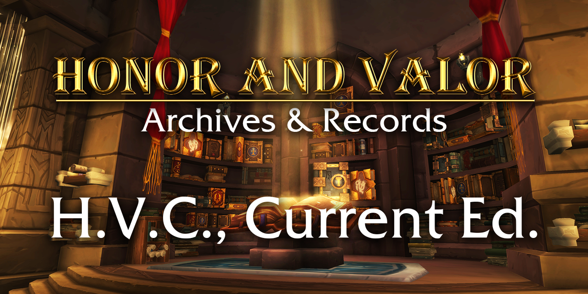

- [The Litany of Honor and Valor](#the-litany-of-honor-and-valor)
      - [Article I](#article-i)
      - [Article II](#article-ii)
      - [Article III](#article-iii)
      - [Amendment I](#amendment-i)
        - [Section 1](#section-1)
        - [Section 2](#section-2)
- [Publication](#publication)
- [Officers](#officers)
- [Conduct](#conduct)
- [Hardcore](#hardcore)
- [Raids and formal combat](#raids-and-formal-combat)
- [Membership](#membership)
- [Raiding](#raiding)
- [Bank](#bank)

# The Litany of Honor and Valor

In the beginning, there was naught but those who sought to walk in the Light—to set wrong things right—to stand tall and proud rather than cower from the fight.

They came from the south.
They came from the north.
But the gaps between them on a map became as nothing as they adventured forth.

For those gaps were bridged with a bond.
Acquaintances became friendships, until finally a family dawned.
That bond was not mightily forged in a day, it took years: grown steadily, nurtured with laughter and tears.

Some of them came and some of them went.
On desperate occasions their principles bent.
Moments of glory waxed and waned.
All too often they lost hope, along with all else they thought they had gained.
But amidst all the drama and odds that had left them drained, hope was never truly lost, for the family remained.

And lo, at long last, it was finally decided that the problem was not “in whom” but “how” the power resided.
It had always been known that for goals to be achieved that one and only one of them could be called upon to lead.
But now, as obligations or apathy pull one leader away, another of the family will answer the call and enter the fray.

This flaw in the past was not easily found, especially whenever hucksters sewing distrust did abound.
But now we understand that all in time will break down when saddled with the full weight of the crown.

To consecrate this litany and honor that we have all bled, the Marshal has rightfully begun his tenure when he has said: “Through our shared years and tears, I trust in my brothers as I take this throne that none of us again shall be asked to walk an unending path alone.”

#### Article I
This guild holds that all players possess rights which are corollaries of ethics as applied to social organizations.
These are: the right to one's own characters; the right to play as one wishes; the right to keep, use, and dispose of the gold and items one has created or looted; and the right to play for one's own sake and fulfillment.

These rights are not granted by the guild but are a part of and given rise from the players and are inalienable.

This guild holds further that it exists only as an institution charged with securing these rights, and that should a guild become destructive of that end, it is the right of the players to alter or to abolish it as they see fit in order to effectively secure their rights.

These rights are the only ones treated by this Litany.
They are the only rights formulated in terms of broad abstractions and resting directly on universal ethical principles.
The numerous applications and implementations of these rights, such as the right to attend guild functions or to be tried fairly for the violation of the rights of others, are charged to the Marshal and require for their validation a process of reduction to these abstract rights.

#### Article II
All members of the guild that understand and agree with its founding principles as outlined in Article I and whose membership shall have attained to the duration of ten years since invitation, regardless of lapses in membership, shall form the Veterans of Honor and Valor.

The Veterans shall select from among their ranks a single person to serve as Marshal of Honor and Valor.
If there are multiple Veterans willing to serve, the winner of a duel or series of duels will become the Marshal.
The Marshal is still a Veteran regardless of his current elevated position.
When the Marshal decides to step down, he may choose his replacement from among the Veterans.
If he does not make a selection, the Veterans must choose from among themselves using the above method.

When any two Veterans duel, each combatant may choose a champion from among any current and willing member of the guild to fight in a duel on their behalf.
The victor of a duel must have struck the final blow and there must have been no combat interference from other players during the duel.

Should a Veteran determine that the Marshal should be replaced, and the Marshal is unwilling to surrender his post, the Veteran may challenge the Marshal in person to a duel.
The Marshal may not refuse the challenge but may choose the setting of the duel.
If the Marshal fails to choose a setting within three days of the challenge being issued, the Veteran may choose the setting, and if the Marshal fails to attend then the duel is forfeit in favor of the Veteran.
If the Veteran is the victor, he shall become the new Marshal.
If the Veteran is not the victor, he shall not be able to challenge the Marshal again for ninety days.

Before a Veteran enters his office, he shall take the following oath: “I hereby declare, on oath, that I absolutely and entirely renounce and abjure all allegiance and fidelity to any guild of which I have heretofore been a subject or citizen; that I will support and defend the Litany of Honor and Valor against all enemies, from those outside the guild, to the very Marshal himself should the need arise under my own rational principles and reasonable conscience; that I will bear true faith and allegiance to the Litany of Honor and Valor; and that I take this obligation freely without any mental reservation.”

#### Article III
The legislative, executive, and judicial power of the guild shall be vested in the Marshal of Honor and Valor.

The Marshal must create uniform regulations for: recruitment and dismissal; looting in raids; punishment for breaking social etiquette or guild rules; organizing communication channels outside of the game; organizing raid groups and PvP teams; and, securing gold or materials for progression.
The Marshal may choose to delegate any of these responsibilities to Veterans or Commanders.

No regulations can be exercised against a member of the guild ex post facto.

The Marshal may appoint any individual within the guild to whom he delegates a portion of his authority to serve as a Commander for such purposes and until such time that the Marshal may decide.
Before a Commander enters his office, he shall take the following oath: “I, of my own free will, without coercion, promise, or inducement of any sort, after having been duly advised and warned of the meaning and consequences of this oath, do now enroll in the Raiding or PvP Service of the Guild of Honor and Valor. I swear to uphold and defend the Guild of Honor and Valor against all its enemies, to protect and defend the liberties and privileges of all its citizens and civilians, to perform such duties as may be assigned to me by direct or delegated authority, and to obey all orders of the Marshal of Honor and Valor and of all Commanders or delegated persons placed over me, and to require such obedience from all members of the Service or other persons placed under my orders - and, while remaining in active service or upon being granted inactive retired status, to carry out all duties and obligations and to enjoy the privileges of guild citizenship.”

The Marshal may delegate powers to groups of Veterans and Commanders to act collectively as legislative, executive, or judicial bodies.
The Marshal may grant to each body the privilege to determine the rules of its proceedings.
Acts of legislative bodies must gain the assent of the Marshal to take effect.

#### Amendment I
(Ratified on the thirtieth of April 2022)

##### Section 1
The requirement of attained duration of years since invitation for Veterans of Honor and Valor is hereby repealed.

##### Section 2
A Veteran may sponsor the invitation of a member of the guild to join the Veterans of Honor and Valor.
When this occurs, the matter shall be put to a vote of the Veterans of Honor and Valor for a period not exceeding three days.
If three fourths of those voting are in favor, the sponsored member shall become a Veteran upon taking the oath.

# Publication

This file is the current code of Honor and Valor.
The Marshal publishes it.
No regulation applies ex post facto.

# Officers

The Marshal holds the powers in Article III and may appoint Commanders.

A Commander-in-Chief, if appointed, commands the raid teams and the other officers, may require an officer's view on their duties, and may grant reprieves and pardons except where the Marshal has reserved the matter. The office returns to the Marshal on death, resignation, removal, or inability.

Every Commander keeps the peace. Commanders apply these rules to every member equally. No member is beyond them, including the Marshal.

In an emergency, the Marshal or a majority of voting Veterans may authorize a Veteran or the Commander-in-Chief to deputize a member to keep the peace. The deputizer is responsible for what the deputy does. Deputies do not take the Commander's oath.

# Conduct

Obstructive behavior that harms other members' play is prohibited. Commanders investigate and apply the penalty named with the rule.

**Communication.** Intent and effect both matter. A joke that lands as distress is still a problem. If the people involved settle it, Commanders leave it alone. If they cannot or will not, the member is told to fix it; then a warning; after three warnings in ninety days, dismissal is on the table.

**Harassment.** Speech or behavior meant to inflict deep emotional distress. Warning, then dismissal. Immediate dismissal if it includes a real-world physical threat or doxxing. That includes, without being a closed list: identity-based abuse; directing anyone to self-harm; stalking; publishing someone's real-world information or contact details in order to force a meeting.

**Nuisance.** Harm or obstruction that is not harassment. Warning, then after three warnings, dismissal. That includes offensive expression, obstruction of play, fraud, and impersonation.

Offensive expression includes violent language, slander, insults, threats, baiting, forcing a playstyle except under these rules or a Marshal declaration, and trying to freeze someone out of the guild except under those same terms.

Obstruction of play includes spam, body-blocking NPCs, grief mailing, mob trains, Misdirection onto a healer, feeding the other faction, and refusing assigned raid duties out of spite.

Fraud is deception meant to take another member's play or property, including broken trade, loot, or betting agreements.

Impersonation is claiming to be another member, an officer, or anyone else.

**Outside politics, religion, and commerce.** Do not run real-world political, religious, or commercial campaigns in guild channels. A collection for a member in genuine need may be allowed by Commanders.

**Guild first on guild disputes.** If a member is harmed by another member in a way that also violates some outside platform rule, report it to Commanders first and do not take it to another authority unless Commanders allow it. Immediate dismissal if this is ignored.

That does not apply when there is imminent real-world danger the guild cannot meet in time, or a threat beyond what the guild can police. It never restricts contact with United States federal, state, or local law enforcement.

**Orders.** A Commander giving an instruction that rests on a Marshal declaration or this code may dismiss a member who ignores it.

# Hardcore

**Murder.** Unlawfully causing the death of another player's hardcore character with malice, express or implied, or causing that death in the commission of another offense regardless of malice. Penalty: permanent dismissal, or execution of the character that committed it.

**Voluntary slaughter.** A hardcore death that would be murder except that it came from a sudden, violent passion after provocation that would move a reasonable person, with no cooling interval. Penalty: suspension of six weeks to one year.

**Involuntary slaughter.** A hardcore death with no intent to kill.
- In a minor unlawful act: suspension of six weeks to six months.
- In a lawful act done in an unlawful manner likely to cause death: a gold fine or suspension up to two weeks.

**Justified force.** Force against a hardcore character is justified in a consented duel to the death or in PvP, unless the player should reasonably believe the other player did not engage voluntarily.

**Defect immunity.** A player acting in good faith is not liable for a hardcore death caused by a hardware or software defect shown by convincing evidence or by the vendor's admission.

# Raids and formal combat

**Desertion.** Using an ability or item to leave combat in order to dodge a wipe, without the party or raid leader's consent, before a reasonable combatant would call the fight lost — including [Vanish](https://www.wowhead.com/classic/spell=1857/vanish), [Feign Death](https://www.wowhead.com/classic/spell=5384/feign-death), [Hearthstone](https://www.wowhead.com/classic/item=6948/hearthstone), or [Flask of Petrification](https://www.wowhead.com/classic/item=13506/flask-of-petrification). Penalty: lifetime dismissal, or whatever else the Marshal directs.

**Away without permission.** Going silent in a party or raid without the leader's consent, except for force majeure such as weather taking the connection down. Penalty as the Marshal directs.

**Misbehavior before other guilds.** In the presence of other guilds: abandoning an agreed duty; endangering the party by disobedience, neglect, or misconduct; cowardice (fear-motivated misbehavior, not mere apprehension); leaving a duty for personal gain such as loot or a quest turn-in; false alarms; not doing one's utmost for the objective; or failing to help members who are in the fight. Penalty as the Marshal directs.

# Membership

**Citizen.** Awarded after two lockouts of progression raiding, or after completing a verified Hardcore Community Challenge and remaining mortal, or after reaching maximum level on a Blizzard Hardcore realm. Renouncing citizenship returns the member to Civilian.

A Commander may strip citizenship for: serving as an officer in a foreign guild; raiding or doing organized group PvP with a foreign group; applying to a foreign guild with the intent to leave; treason; or, for a Citizen admitted through raiding, missing four weeks of lockouts without notice.

# Raiding

**Progression loot.** Only raids the Marshal has named as progression use the guild loot system. The Marshal says how many soft reserves each raider gets and whether anything is hard reserved.

Those raids are master-looted at uncommon quality. The raid leader posts a softres.it link before the raid. BoP drops are awarded main spec over off spec, honoring soft reserves. The raid leader may have the master looter take an item to trade after the pull if that keeps the raid moving.

**Progression list.** The Marshal names which encounters are progression. None are named. None have been retired.

**Consumables and add-ons.** In World of Warcraft Forever, none are required for any role. No add-ons are required.

**Raid groups.** A Citizen or higher may start a raid group. An officer who can create the Discord channel and grant Raid Leadership should do so when asked. Sign-ups go up at least four calendar days before the raid. Non-progression loot rules are the raid leader's to set, and they are fixed before sign-ups go up. Every raid needs a disenchanter.

Bank-reserved drops and all enchanting materials from raids go to the guild bank whether the instance is progression or not. Unwanted tokens for disenchantable items go to the disenchanter so the materials can be deposited.

# Bank

Reserved for the bank from raids: BoE items nobody in the raid has earmarked, unbound profession training items, and crafting materials.

Veterans and Commanders run the bank. They set tab names, icons, and rank permissions; the Marshal applies that in game. They pin in Discord what the bank wants deposited.

They may convert stock at their discretion by selling BoEs or used items and depositing:
- proceeds of enchanting materials and gems sold to members for mains at ten percent of fair market value;
- proceeds of other items at fair market value;
- disenchanted materials; or
- auction-house profit after the fee.

They should keep stores members will actually use. They must not shatter an item when Wowhead says its market value beats the likely shard value. Auction-house deposits on unsold listings may come out of guild gold.
